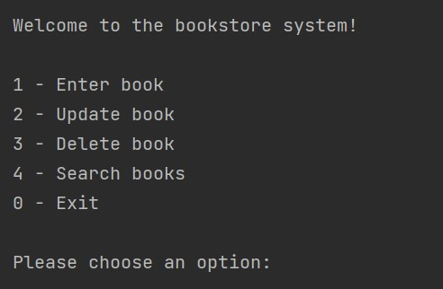
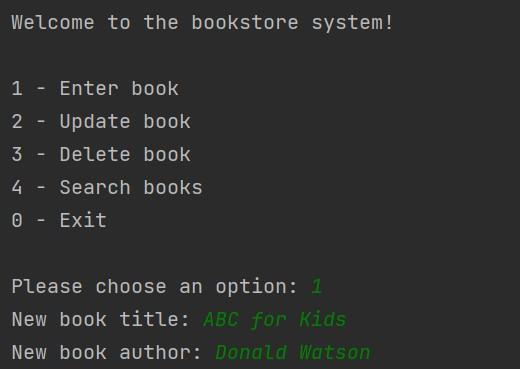

# Project Name: ebookstore

### Project Description: This project creates a SQLite3 database and provides functions for the book clerks to add, update, delete and search books

# Table of Contents
1. [Installation](#installation)
2. [Usage](#usage)
    * [Enter book](#enter-book)
    * [Update book](#update-book)
    * [Delete book](#delete-book)
    * [Search book](#search-book)
3. [Credits](#credits)

## Installation
Windows (manual installation)

Open commmand prompt and enter the following command.

```cmd
curl -o book.py https://raw.githubusercontent.com/late-coder-2022/E-Bookstore/master/book.py
```

## Usage
Enter the program and the main menu will be displayed!



#### Enter book

Enter 1 to add a book


Enter the book name


Enter the book author



Enter the book quantity


#### Update book

Enter 2 to update a book


Enter the book id


#### Delete book


#### Search book


## Credits


